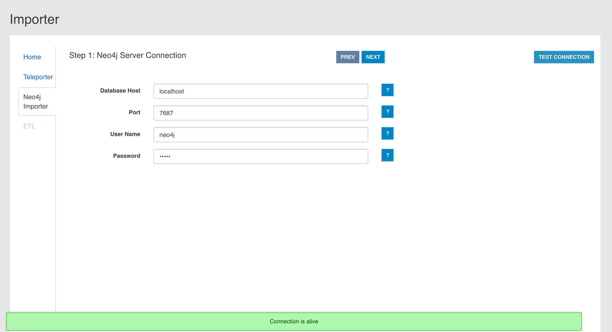
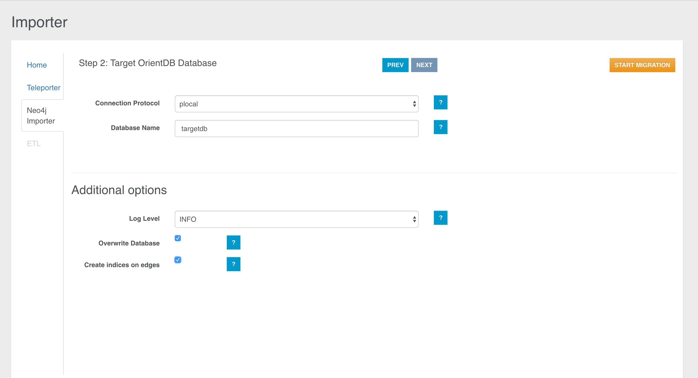
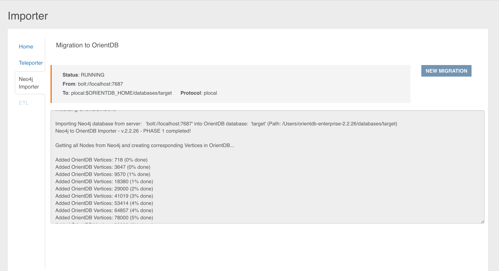
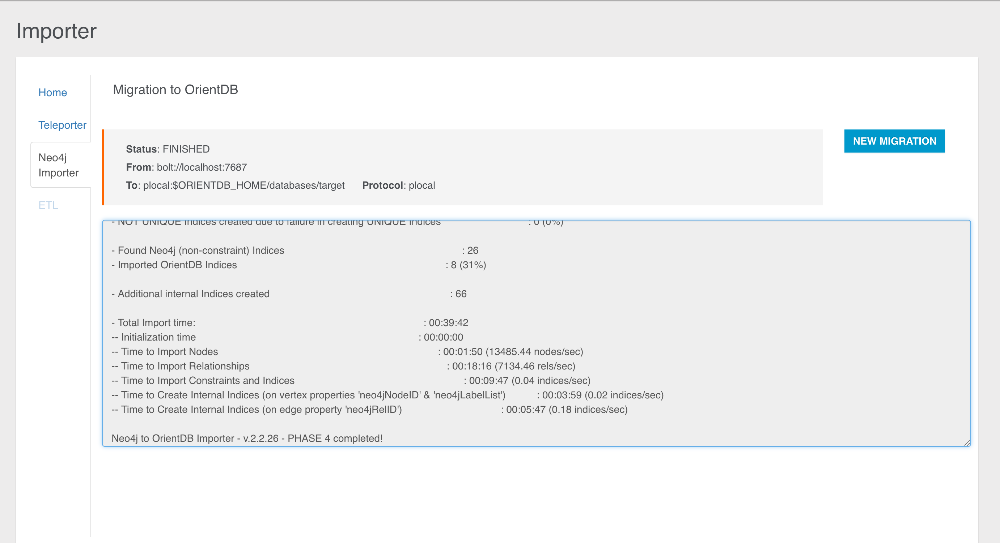

---
search:
  keywords: ["Studio", "neo4j", "enterprise"]
---

> Only users with grant `server.importers` can see this section

# Neo4j to OrientDB Importer

In Studio 2.2 you can configure the execution of a new plugin, which allows you to import your Neo4j database into OrientDB in few simple steps.

Imported neo4j items are:

- nodes
- relationships
- unique constraints
- indexes

**NOTE**: This feature is available both for the [OrientDB Enterprise Edition]({{book.enterpriseSite}}) and the [OrientDB Community Edition]({{book.communitySite}}).

This visual tool consists in a wizard composed of 2 simple steps.
Let's have a look at each configuration step.

### Step 1

In the first step you have to type the following required parameters:

- `Database Host`, as the address of the host where the neo4j server is available
- `Port`, as the port where your neo4j server is listening for new connections via the bolt binary protocol (default port is 7687)
- `User Name`, as the username to access the neo4j server
- `Password`, as the password to access the neo4j server

After you typed all the required parameters for the migration you can test the connection with the source database.

### Step 2

In the second step you have to specify the parameters about the OrientDB target database and some additional info:

- `Connection protocol`, as the protocol adopted during the migration in order to connect to OrientDB. You have to choose among:
  - plocal: persistent disk-based, where the access is made in the same JVM process
  - memory: all data remain in memory
- `OrientDB Database Name`, as the target database name where the Neo4j database will be migrated. The database will be created by the import tool if not present. In case the database already exists, the Neo4j to OrientDB Importer will behave accordingly to the checkbox below.
- `Log Level`, as the level of verbosity printed to the output during the execution. You can choose among:
  - NO
  - DEBUG
  - INFO
  - WARNING
  - ERROR
- `Overwrite Database`, checkbox to overwrite OrientDB target database if it already exists.
- `Create indices on edges`, checkbox to create indices on imported edges in OrientDB. In this way an index will be built for each Edge class on `'Neo4jRelId'` property.

Once we have collected all the info, you can run your configured job through the `START MIGRATION` button, then the job progress monitor will be displayed:

At the end of the migration, statistics about the process are reported as shown below:

### Migration Details

Internally, the _Neo4j to OrientDB Importer_ makes use of:

- the Neo4j's bolt connector based on the the Bolt binary protocol to read the graph database from Neo4j
- the OrientDB's java API to store the graph into OrientDB

The migration consists of four phases:

- **Phase 1**: Connection initialization to Neo4j
- **Phase 2**: Migration of nodes and relationships present in the source graph database
- **Phase 3**: Schema migration
- **Phase 4**: Shutdown of the connection to Neo4j and summary info reporting

#### General Migration Details

The following are some general migration details that is good to keep in mind:

- In case a node in Neo4j has no _Label_, it will be imported in OrientDB into the Class _"GenericClassNeo4jConversion"_.

- In case a node in Neo4j has multiple _Labels_, it will be imported into the `Class` _"MultipleLabelNeo4jConversion"_.

- List of original Neo4j _Labels_ are stored as properties in the imported OrientDB vertices (property: _"Neo4jLabelList"_).

- During the import, a not unique index is created on the property _"Neo4jLabelList"_. This allows you to query by _Label_ even over nodes migrated into the single `Class` _"MultipleLabelNeo4jConversion"_, using queries like:
  `SELECT FROM V WHERE Neo4jLabelList CONTAINS 'your_label_here'` or the equivalent with the [MATCH]({{book.baseCommunityDoc}}/sql/SQL-Match.md) syntax: `MATCH {class: V, as: your_alias, where: (Neo4jLabelList CONTAINS 'your_label'} RETURN your_alias`.

- Original Neo4j `IDs` are stored as properties in the imported OrientDB vertices and edges (`Neo4jNodeID` for vertices and `Neo4jRelID` for edges). Such properties can be (manually) removed at the end of the import, if not needed.

- During the import, an OrientDB index is created on the property `Neo4jNodeID` for all imported vertex `classes` (node's _Labels_ in Neo4j). This is to speed up vertices lookup during edge creation. The created indexes can be (manually) removed at the end of the import, if not needed.

- In case a Neo4j Relationship has the same name of a Neo4j _Label_, e.g. _"RelationshipName"_, the _Neo4j to OrientDB Importer_ will import that relationship into OrientDB in the class `E_RelationshipName` (i.e. prefixing the Neo4j's `RelationshipType` with an `E_`).

- Neo4j Nodes with same _Label_ but different case, e.g. _LABEL_ and _LAbel_ will be aggregated into a single OrientDB vertex `Class`.

- Neo4j Relationship with same name but different case, e.g. _relaTIONship_ and _RELATIONSHIP_ will be aggregated into a single OrientDB edge `Class`

- Migration of Neo4j's _"existence"_ constraints (only available in the Neo4j's Enterprise Edition) is currently not implemented.

- During the creation of properties in OrientDB, Neo4j `Char` data type is mapped to a `String` data type.

#### Details about Schema Migration

The following are some schema-specific migration details that is good to keep in mind:

- If in Neo4j there are no constraints nor indexes, and if after we drop, after the migration, the properties and indexes created for internal purposes (`Neo4jNodeID`, `Neo4jRelID`, `Neo4jLabelList` and corresponding indexes), the imported OrientDB database is schemaless.

- If in Neo4j there are constraints or indexes, the imported OrientDB database is schema-hybrid (with some properties defined). In particular, for any constraint and index:

      	- The Neo4j property where the constraint or index is defined on, is determined.

      	- A corresponding property is created in OrientDB (hence the schema-hybrid mode).

- If a Neo4j unique constraint is found, a corresponding unique index is created in OrientDB

      	- In case the creation of the unique index fails, a not unique index will be created. Note: this scenario can happen, by design, when migrating nodes that have multiple _Labels_, as they are imported into a single vertex `Class`).

- If a Neo4j index is found, a corresponding (not unique) OrientDB index is created.

#### Migration Best Practices

According to the migration logic shown so far, we can define the following best practices, adoptable before the migration towards OrientDB:

1. Check if you are using _Labels_ with same name but different case, e.g. _LABEL_ and _LAbel_ and if you really need them. If the correct _Label_ is _Label_, change _LABEL_ and _LAbel_ to _Label_ in the original Neo4j database before the import. If you really cannot change them, be aware that with the current version of the Neo4j to OrientDB Importer such nodes will be aggregated into a single OrientDB vertex `Class`.

2. Check if you are using relationships with same name but different case, e.g. _relaTIONship_ and _RELATIONSHIP_ and if you really need them. If the correct relationship is _Relationship_, change _relaTIONship_ and _RELATIONSHIP_ to _Relationship_ before the import. If you really cannot change them, be aware that with the current version of the Neo4j to OrientDB Importer such relationships will be aggregated into a single OrientDB edge `Class`.

3. Check your constraints and indexes before starting the import. Sometime you have more constraints or indexes than needed, e.g. old ones that you created on _Labels_ that you are not using anymore. These constraints will be migrated as well, so a best practice is to check that you have defined, in Neo4j, only those that you really want to import. To check constraints and indexes in Neo4j, you can type `:schema` in the Browser and then click on the "play" icon. Please delete the not needed items.

4. Check if you are using nodes with multiple _Labels_, and if you really need more than one _Label_ on them. Be aware that with current version of the Neo4j to OrientDB Importer such nodes with multiple _Labels_ will be imported into a single OrientDB `Class` ("_MultipleLabelNeo4jConversion_").
