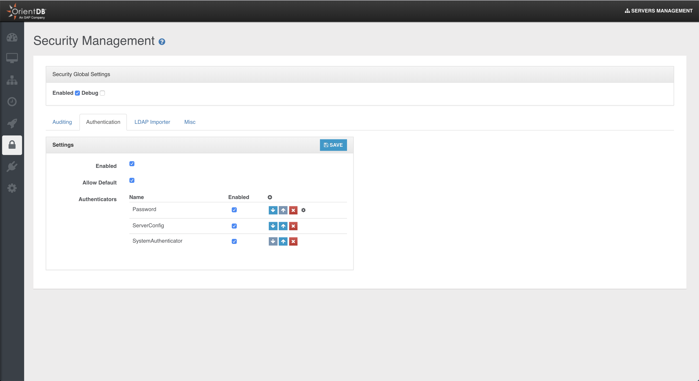
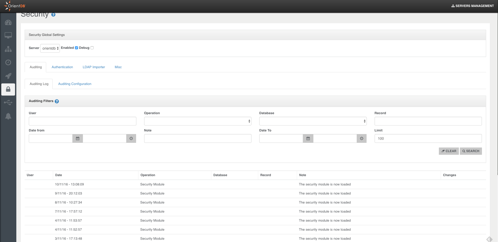
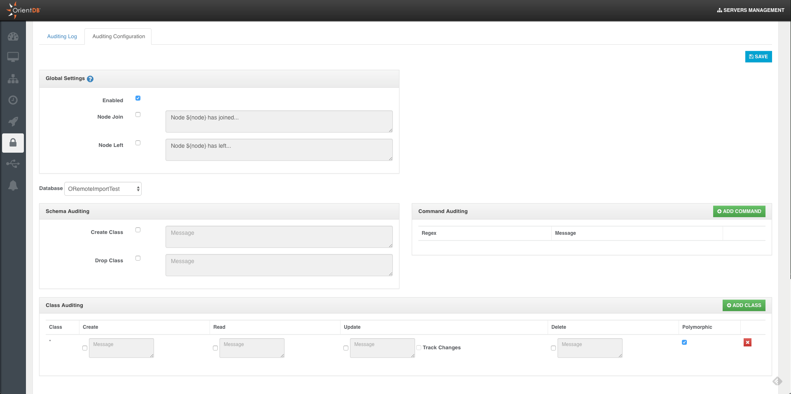

---
search:
   keywords: ['Studio', 'audit']
---

> Only users with grant `server.security` can see this section 

>**NOTE**: This feature is available only in the [OrientDB Enterprise Edition](http://orientdb.com/orientdb-enterprise). If you are interested in a commercial license look at [OrientDB Subscription Packages](http://orientdb.com/support).

# Security

To understand how Security works, please refer to the [Security]({{book.baseCommunityDoc}}/security/Security.html) page.

The configuration of security is stored in the `security.json` file. 

By using the Enterprise edition the configuration of the security can be changed at runtime, via REST APIs or using the Studio EE extension.

For a detailed documentation of Security config check the new [Security Feature]({{book.baseCommunityDoc}}/security/Security-OrientDB-New-Security-Features.html) page.

# Auditing

To understand how Auditing works, please refer to the [Auditing](./Auditing.md) page.

By default all the auditing logs are saved as documents of class `OAuditingLog` in the internal database `OSystem`. If your account has enough privileges, you can directly query the auditing log. Example on retrieving last 20 logs: `select from OAuditingLog order by @rid desc limit 20`. 

However, Studio provides a panel to filter the Auditing Log messages on a specific server without using SQL.

Studio Auditing panel helps you also on Auditing configuration of servers, avoiding to edit the `auditing-config.json` file under the database folder.

