---
search:
   keywords: ['Studio', 'teleporter', 'enterprise']
---

> Only users with grant `server.importers` can see this section 

# Teleporter

In Studio 2.2 you can configure the execution of the new Teleporter plugin, which allows you to import your relational database into OrientDB in few simple steps.
If you are interested in a detailed description of the tool, of its inner workings and features you can view the [Teleporter Documentation]({{book.baseCommunityDoc}}/teleporter/Teleporter-Home.html).

**NOTE**: This feature is available both for the [OrientDB Enterprise Edition](http://orientdb.com/orientdb-enterprise) and the [OrientDB Community Edition](http://orientdb.com/download/). **But beware**: in **Community Edition** you can migrate your source relational database but **you cannot enjoy the synchronize feature**, only available in the **Enterprise Edition**.

This visual tool consists in a wizard composed of 4 steps, where just **Step 1** and **Step 2** are strictly necessary in order to perform your migration.
Let's have a look at each configuration step.

### Step 1

In the first step you have to type the following required parameters:
- `Database Driver`, as the driver name of the DBMS from which you want to execute the import. You have to choose among:
  - Oracle
  - SQLServer
  - Mysql
  - PostgreSQL
  - HyperSQL
- `Database Host`, as the host where your DBMS instance is running on
- `Port`, as the port where your DBMS is listening on
- `Database Name`, as the name of the source database
- `User Name`, as the username to access the source database (it may be blank)
- `Password`, as the password to access the source database (it may be blank)

After you typed all the required parameters for the migration you can test the connection.

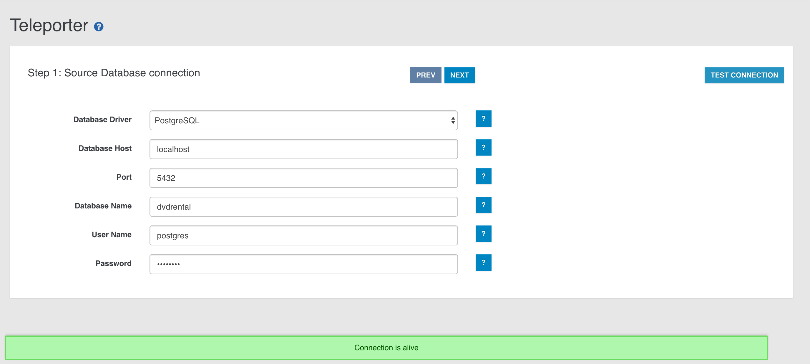

### Step 2

In the second step you have to specify all the parameters about the OrientDB target database:
- `Connection protocol`, as the protocol adopted to write in OrientDB. You have to choose among:
  - plocal
  - memory
- `OrientDB Database Name`, as the name of the target database in OrientDB
- `Strategy`, as the strategy adopted during the migration ([More]({{book.baseCommunityDoc}}/teleporter/Teleporter-Home.html) about strategies)
- `Name Resolver`, as the basic name resolver to adopt during names' resolution
- `Inheritance descriptor`, as the XML file's path. In this descriptor you can report all the info describing inheritance relationships present between the tables in the source database
- `Log Level`, as the log level adopted by Teleporter during the migration. You can choose among: 
  - NO
  - DEBUG
  - INFO
  - WARNING
  - ERROR
  
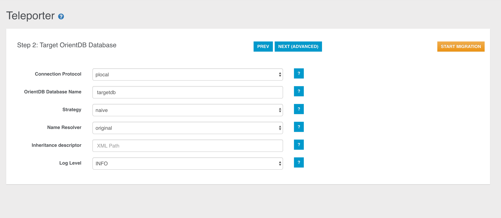

Once we have collected all the minimal info needed for the migration, you can run your configured job through the `START MIGRATION` button, then the job progress monitor will be displayed:

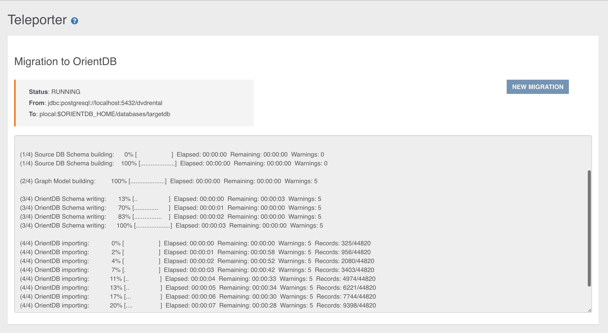

At the end of the migration, statistics and warnings about the process are reported as shown below:

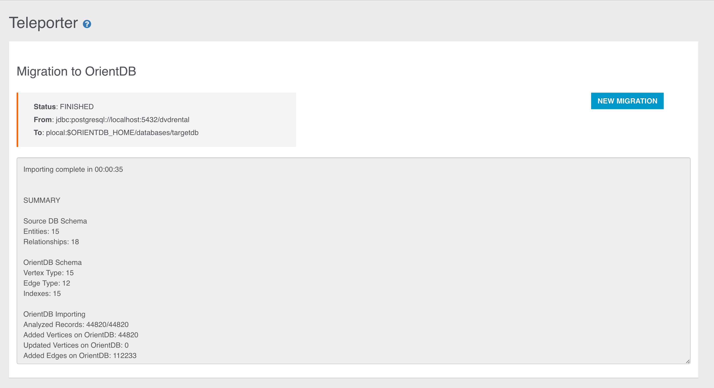

Otherwise you can go on in your migrationg customisation jumping to the next step.

### Step 3

Here you can exploit Teleporter's filtering features: in the panel on the left all the tables present in the source database are reported. If you want migrate just a subset of these tables, you just have to select and move them in the right panel through the specific buttons (you can also drag-and-drop the selected items).

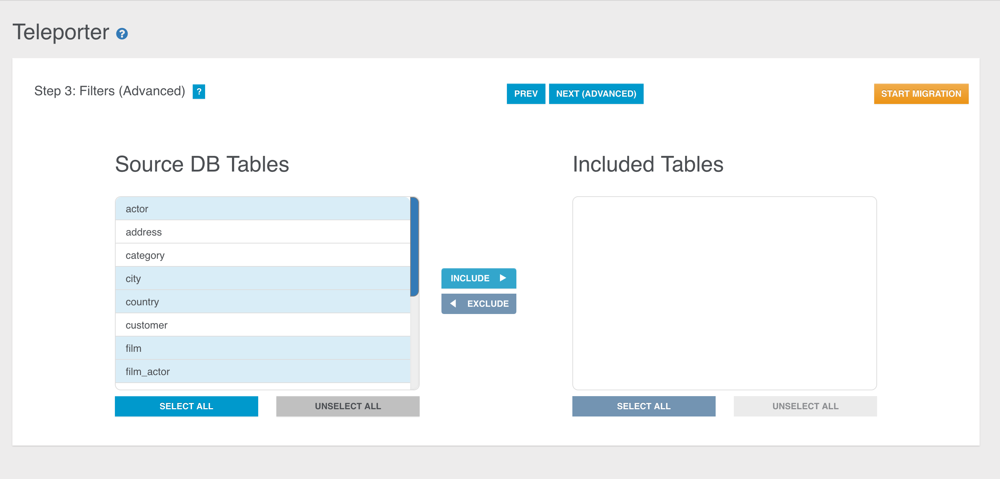

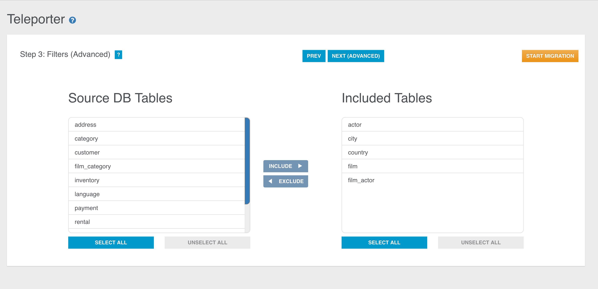

You can perform the same operations also in the opposite direction, that is excluding some tables during the migration just moving them from the right panel to the left one.

If the right panel is empty, no filters will be applied. Instead, if the right panel is not empty, just the selected tables in the right panel will be imported while all the others will be filtered out. 
Thus, for example, these two configurations are equivalent:

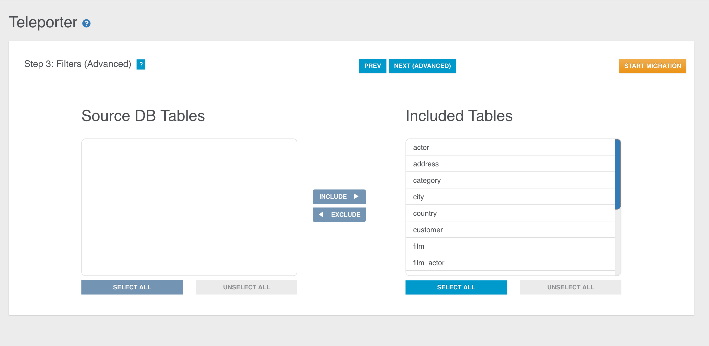

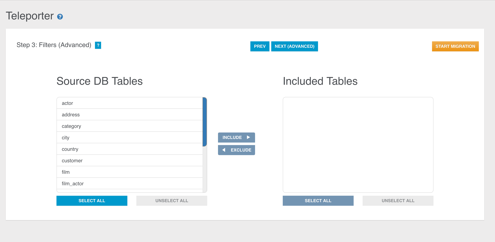

Here too you can start your migration or go to the 4th and last configuration step.

### Step 4

In the last step Teleporter will provide you a Graph Model coming from the translation of the ER-Model inferred from the source database schema. The correspondent Graph Model is built according to basic mapping rules and your choices as well (filters applied, chosen strategy, name resolver adopted etc.). 
This step has two aims:
- it gives you an idea of how your source database will appear once imported in OrientDB
- it allows you to edit the graph model

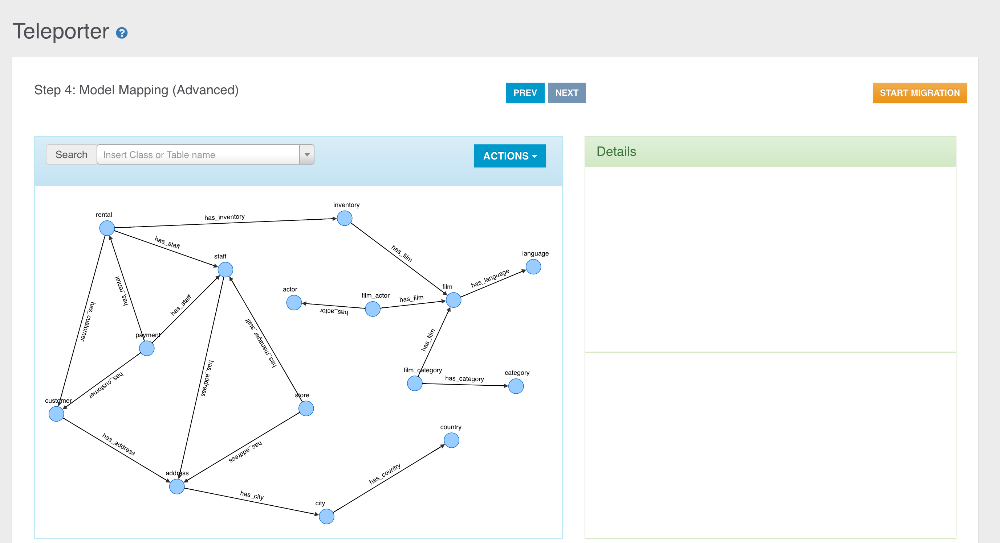

You can see two panels, the Graph Model Panel on the left, containing the Graph Model built from Teleporter, and the Details Panel on the right, reporting all the details about the current selected element in the left panel.

The Details Panel is divided into two sections:
1. in the top area you can enjoy a graph perspective of the element selected in the Graph Panel: you can inspect info about the OrientDB schema, like class name and properties.
2. in the bottom area you have a source-schema perspective, where you got the source-schema items the information above comes from. 

This step is conceived to make very easy the graph model editing and to change the mapping with the source database schema. In fact you can modify the basic mapping 

  - Renaming classes (both for Vertex and Edge classes)
  - Excluding/re-including a property mapped with a column in the correspondent source table
  - Adding new properties
  - Dropping existent properties
  - Editing properties
  - Adding new Edge classes and/or instances 
  - Inspecting original schema data, both for tables and relationships
  
Let's have a deeper look at each of these operations.

#### Inspecting Classes and source correspondent elements

Via the Details Panel you can inspect information about:

1. Vertex class

If you select a Vertex Class, you can inspect the correspondence between each column in the source table and the correspondent property in the translated Vertex class. Columns and properties are strongly bound: you can exclude, include or rename a property, but the bindings with the correspondent column will remain.

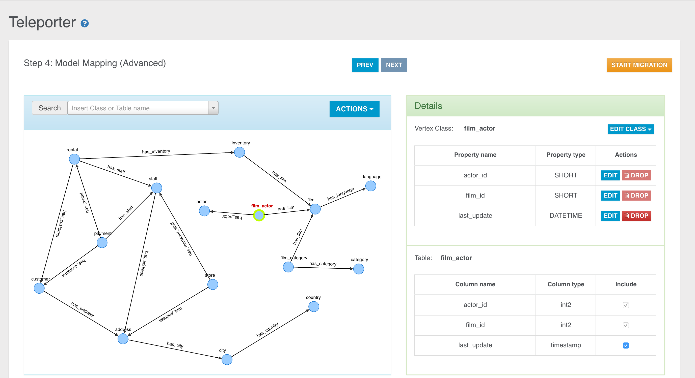

2. Edge Class

Everytime you select an edge in the graph, you can find out about the original relationship it comes from in the bottom section in the Details Panel. We can have 2 kinds of relationships, and coherently 2 kinds of edge rendering.

  - 1-N Relationship

    Edges coming from 1-N Relationships are represented through a continous arrow.

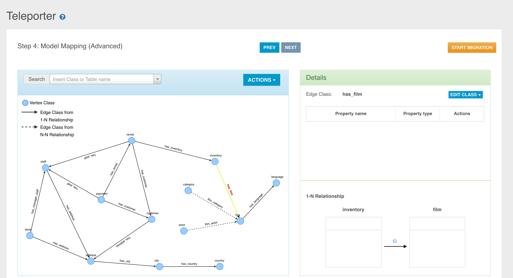

   The rendered Relationship involves just two tables of course, the starting table (aka **foreign table**) and the arrival table (aka **parent table**). Clicking the question mark you can also see for each table all the columns involved in the relationship.

  - N-N Relationship

    Let's suppose you have got the following graph, obtained performing join tables aggregation through the naive-aggregate strategy.

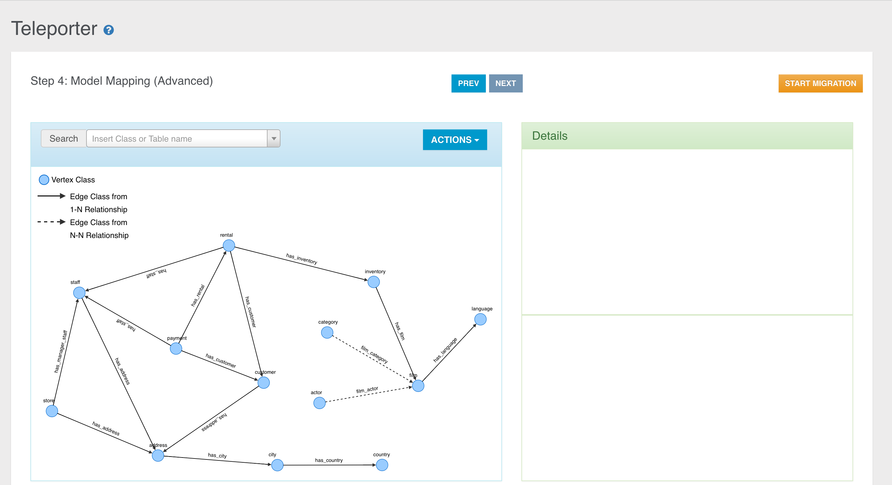

   Edges coming from N-N Relationships are represented through a dashed arrow and in the bottom you can see the 2 relationships involving two external tables and the join table between them.

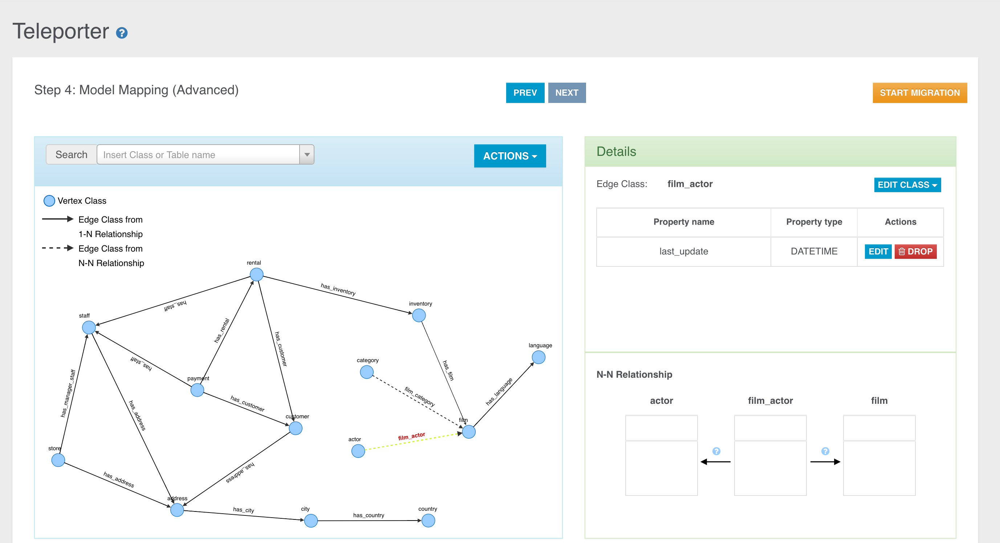

   Here too, clicking the question mark you can inspect the involved columns for both the relationships.
   

 

#### Search Bar

In the Graph Panel a useful search bar is provided to allow you fast vertex selection according to the vertex class name or the source table name.

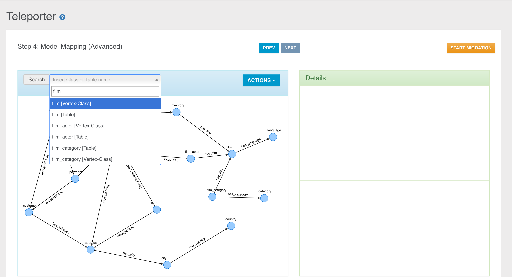

In the example above you can see that for each class we have two items, the vertex class name and the source table name. In this case each couple of items are equal because no classes were renamed nor a name resolver was adoted during the basic graph model building.

#### Class Renaming

You can rename a class just selecting an element in the graph (vertex or edge) and clicking the "Rename Class" button in the "Edit Class" dropdown menu.

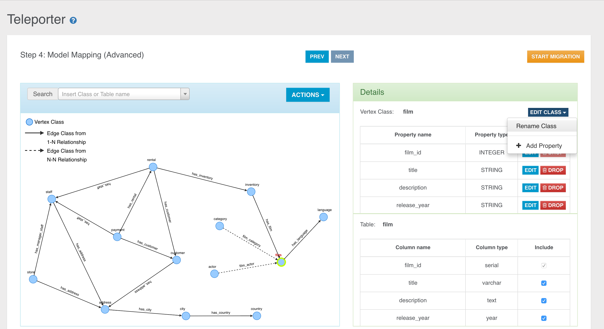

Then you just have to choose the new name for the specific class.

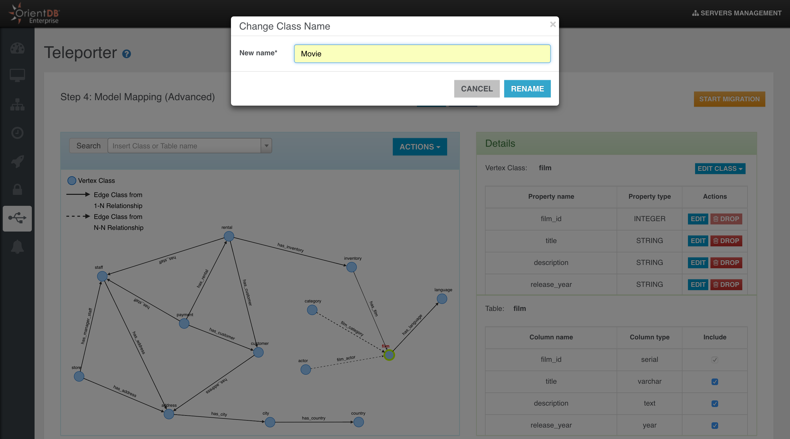

The class name will be updated in the graph, in the search bar and in the Details Panel of course.

#### Property Excluding

We have two ways to exclude a property mapped with a column in the source table:

1. Unflagging the correspondent column name in the source table perspective.

2. Dropping the property from the class perspective.

#### Property Dropping

You can also drop a property via the specific button.

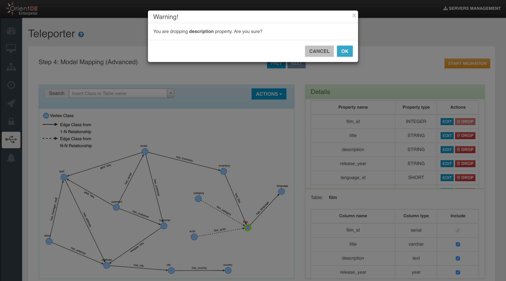

You can have 2 different behaviours depending on whether the property is bound with a column in the source table or not. 

- If the property is bound with a source column, when you drop it you will get the same result as when you exclude it, so it will not be migrated in OrientDB but you can always include it again, as the binding is not deleted at all.
 
- If the property is not bound with a source column, then when you drop it the property will be definitively deleted.

#### Property Adding

You can add new properties just clicking the "Add property" button in the "Edit Class" dropdown menu.

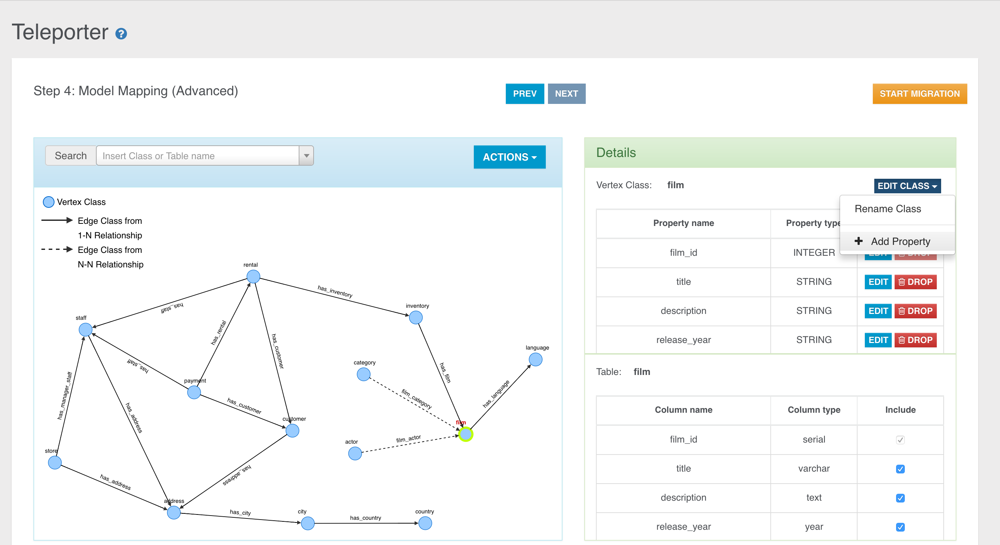

In the just opened window you can choose to add a new property never defined before, selecting the "Add new property" radio button, 

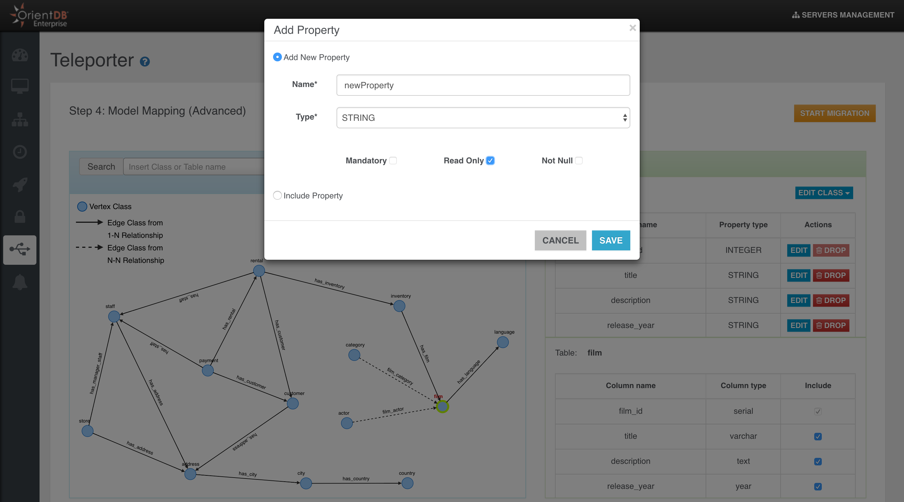

or re-include some excluded properties if any, selecting the "Include Property" radio button.

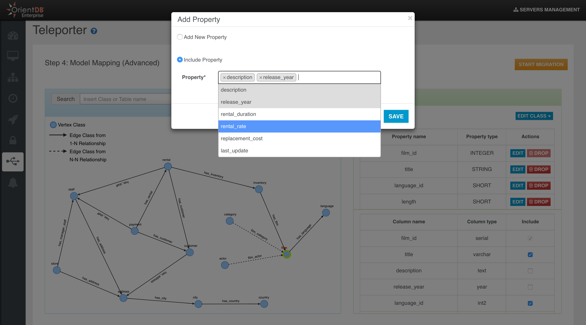

#### Property Editing

You can also edit an existing property: you can choose a different name, type, or just add/remove some constraints.

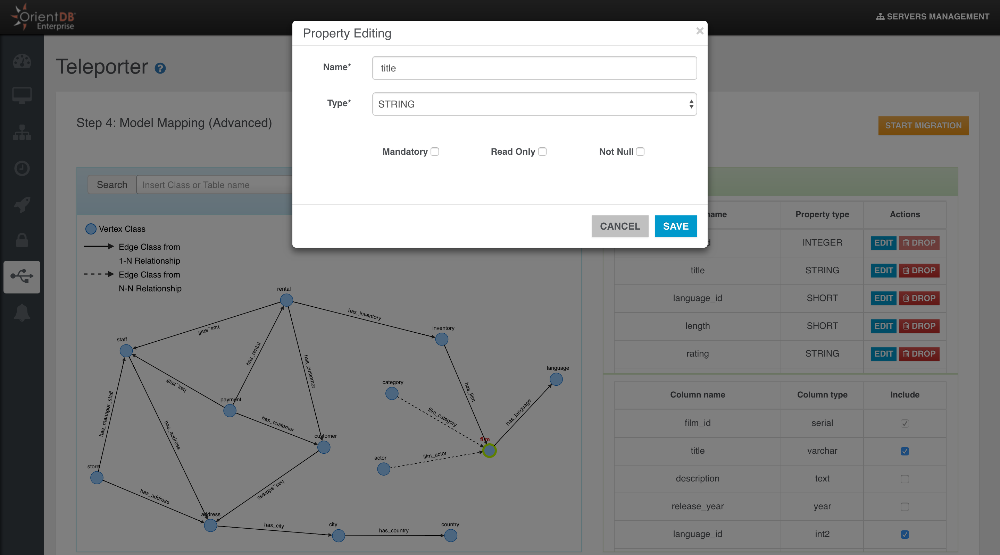

#### Property Including

We have two ways to include a property mapped with a column in the source table:

1. Flagging the correspondent column name in the source table perspective.

2. Including the property from the OrientDB class perspective through the "Add property" button as shown above.

#### Edge Adding

Often you need to add an edge in your graph model, if it's missing for some reason.
For example, if you didn't defined some foreign keys between the tables on which you usually perform join operations, you will lose this kind of info during the importing process and you will not have any edges in your final Graph Database.
Sometimes you just want to enrich the model adding new edges. 
In both the cases you have to select a vertex in the graph and then click the "Add Edge" button in the "Action" dropdown menu. 

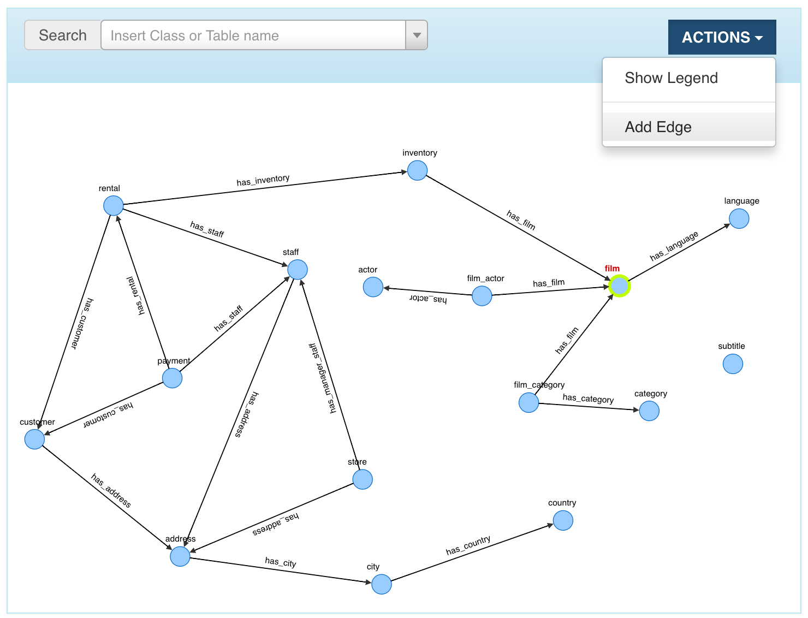

Then you have to drag the edge till the target vertex and click over it.

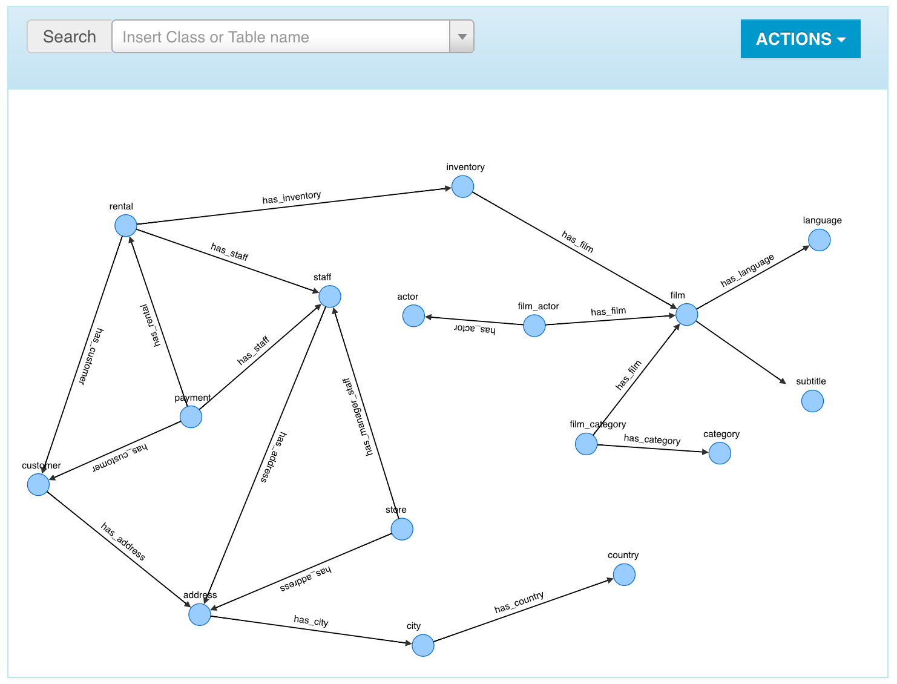

A new window will open where you have to specifiy the name of the Edge class for the new edge instance and some mapping info:

- fromTable: the foreign table that imports the primary key of the parent table.
- fromColumns: the attributes involved in the foreign key.
- toTable: the parent table whose primary key is imported by the foreign table.
- toColumns: the attributes involved in the imported primary key.

As said above, when we want to create a new edge instance, we can create a new Edge class

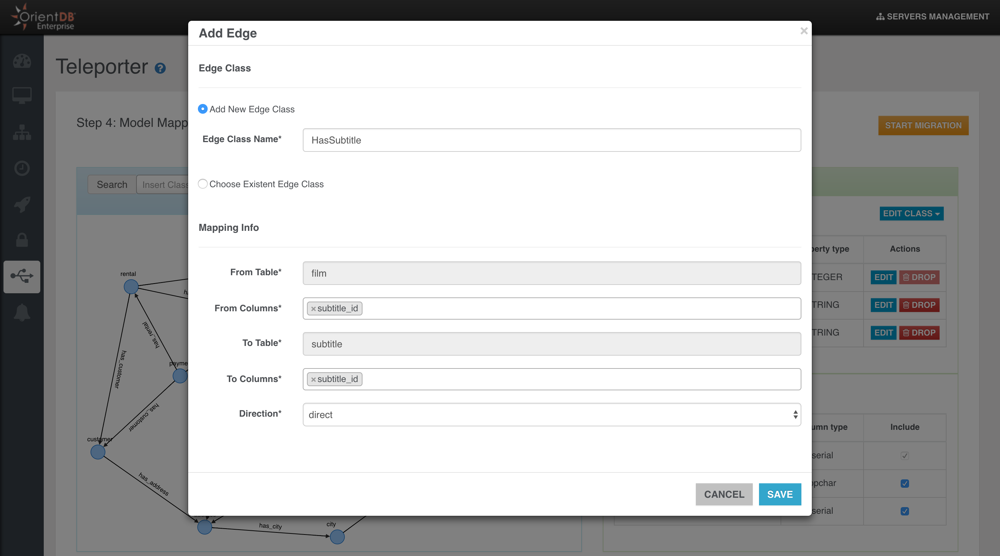

or just choose a preexisting Edge class 

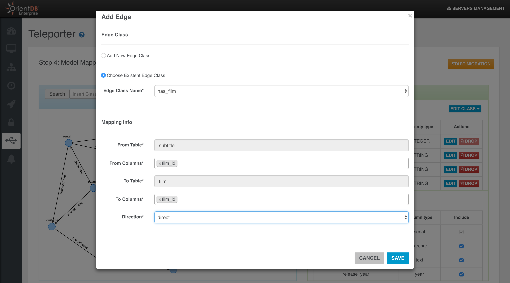

#### Edge Dropping

When you select an edge in the graph model, you have 2 choices:

1. Delete the Edge class with all its instances

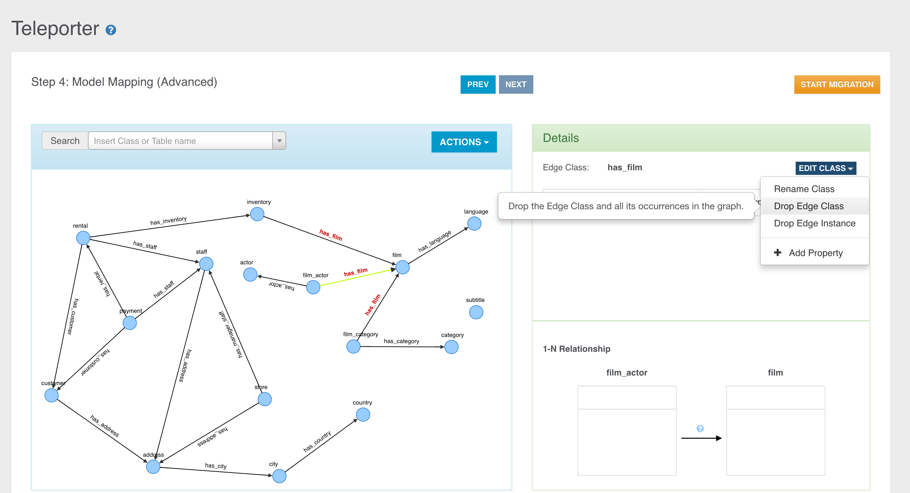

2. Delete only the selected instance of the specific Edge Class

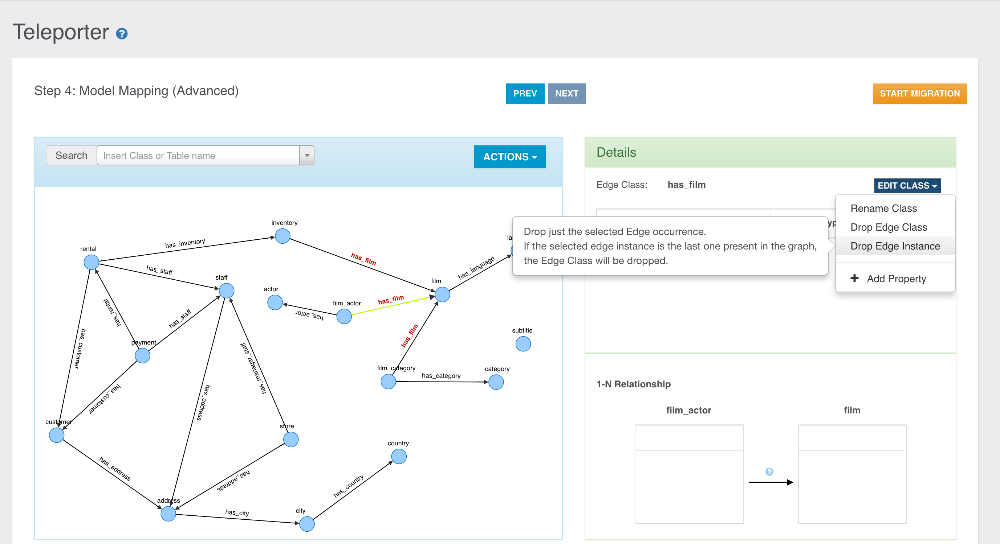

